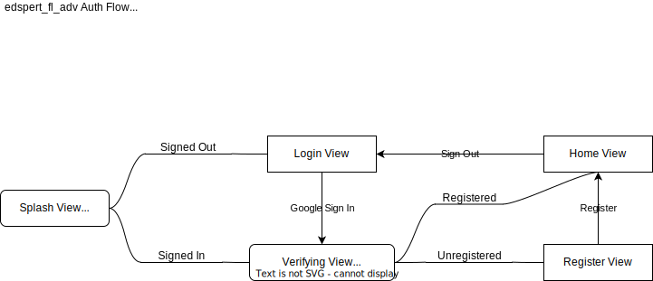

# edspert_fl_adv

Flutter Project from [edspert.id](https://edspert.id) Flutter Bootcamp Batch 20.

What we learn from the bootcamp:

- Flutter Slicing UI.
- Dart HTTP Request.
- Code Design Pattern.
- State Management ([BLOC](https://bloclibrary.dev/)).
- [Firebase](https://firebase.google.com/) Integration (Firebase Auth and
  Storage).

## Others

