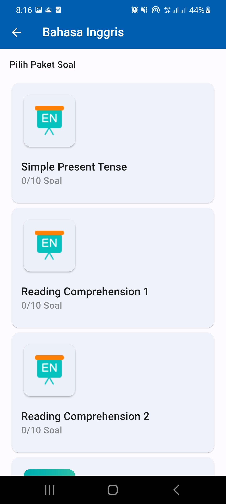

# edspert_fl_adv

Flutter Project from [edspert.id](https://edspert.id) Flutter Bootcamp Batch 20.

What we learn from the bootcamp:

- Flutter Slicing UI.
- Dart HTTP Request.
- Code Design Pattern.
- State Management ([BLOC](https://bloclibrary.dev/)).
- [Firebase](https://firebase.google.com/) Integration (Firebase Auth and
  Storage).

Ref:

- [App Figma Design](https://www.figma.com/file/vht1hANiGM1sFld1zidoCG/Bootcamp-Flutter-Edspert)
- [App RESTApi Server](https://documenter.getpostman.com/view/17757271/2s847FwEJx)

## App Screenshots

    
    
    
    
    
    
    
    

## Others

See [AuthCubit](lib/interfaces/providers/res/auth/auth_cubit.dart) for the Auth
Flow on app router.

Currently the Splash and Verifying View are located on
[AuthView](lib/interfaces/views/auth/auth_view.dart) (splash on startup) and
[RegisterView](lib/interfaces/views/auth/register_view/register_view.dart)
(verify indicator).
